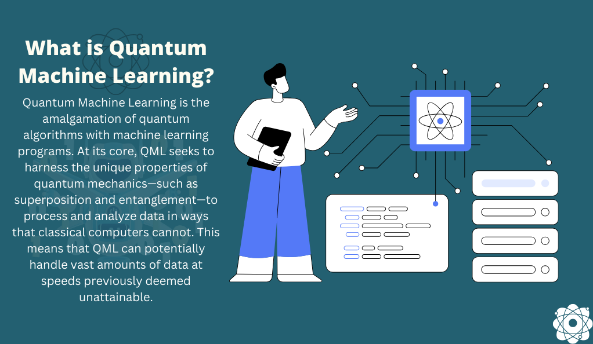
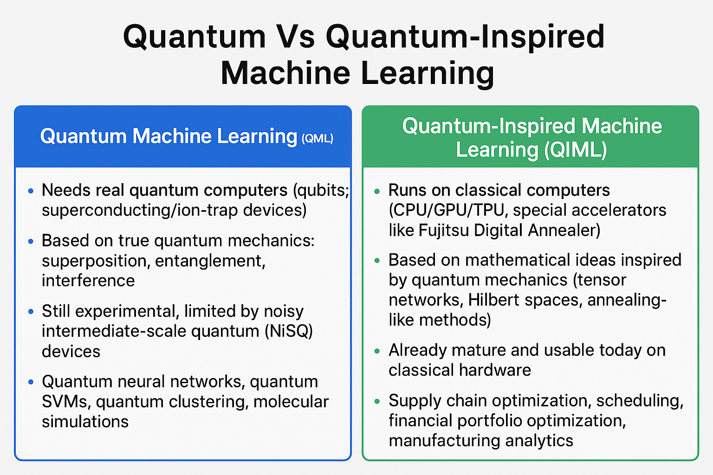
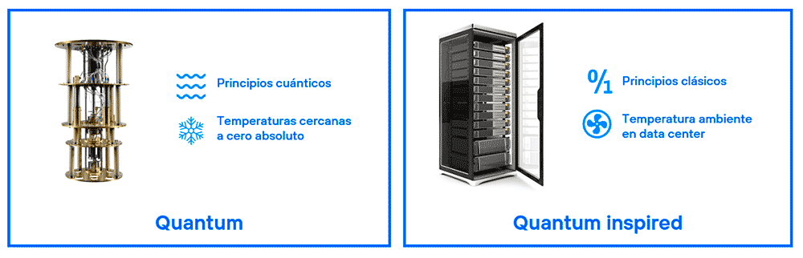

# 🚀 Gateway to Quantum AI: Industrialization of Quantum AI  
🧩 Quantum-Computing-Basics | ⚛️ Quantum-Algorithms | 🤖 Quantum-Machine-Learning | 🌌 Quantum-Inspired-ML | 🔗 Hybrid-Quantum-Classical-Models | 🏭 Industrial-Applications | 📈 Challenges-&-Future-Directions | 🛠 Tools-&-Frameworks |

### Industrialization of Quantum AI

Welcome Onboard to the Quantum Wonderland!

Embark on an exhilarating voyage through the mesmerizing landscape of Quantum Machine Learning (Quantum ML), where the breathtaking fusion of quantum computing and artificial intelligence unlocks a brand-new era of possibilities. Picture yourself soaring above the vast, intricate realms of Quantum AI—each vista offering panoramic insights, elegant constructs, and striking visualizations that illuminate the secrets behind this technological renaissance.

Your adventure begins with captivating infographics and thoughtfully-curated design guides, easing you into the vibrant world of Quantum ML. Here, you’ll encounter the dazzling synergy that powers breakthroughs in fields like finance, healthcare, logistics, defense, and manufacturing. Imagine savoring extraordinary feats—speedy drug discovery, real-time supply chain optimization, and proactive fraud detection—challenges once deemed impossible by classical means, now conquered through quantum ingenuity.

But the journey goes far beyond mere introductions. As you navigate deeper, prepare to relish hands-on tutorials and authentic, real-world examples—each code set carefully crafted to showcase Quantum ML’s unique ability to process vast datasets, simulate complex phenomena, and solve optimization puzzles with remarkable speed. This is where the exhilarating flavors of Quantum AI unfold before you, tangy and sweet, drawing you into the practice and potential of next-generation intelligence.

And what a transformative route it is! From the shimmering waves of quantum mechanics to the practical corridors of Quantum ML applications, every milestone is artfully arranged to deliver a truly sumptuous learning experience. Whether you’re a curious newcomer, a passionate developer, or a seasoned researcher, this itinerary invites you to join the global shift—unleashing the wonders of Quantum ML to reshape industries, revolutionize problem-solving, and chart new horizons for humankind.

Let’s transcend boundaries together, journeying through a decade of deep, hands-on enterprise AI and quantum frontiers. Welcome to the future—today!

### Why Quantum 

Quantum computing harnesses the principles of superposition, entanglement, and quantum parallelism to process data in ways that classical computers can't. Traditional bits are replaced by qubits, which can represent multiple states simultaneously—allowing quantum systems to explore many potential solutions at once. This makes quantum particularly powerful for problems involving optimization, simulation, and machine learning.

As industries face growing complexity, from global supply chains to real-time decision-making, classical computing is hitting limits. Quantum AI offers a paradigm shift. It enables faster training of AI models, real-time route optimization, secure communication via quantum cryptography, and materials discovery at the atomic level. With major players like IBM, Google, and Amazon investing heavily, the quantum era is not a concept—it's happening now.

                                    Applications in Quantum AI

## Who Benefits from Quantum AI

Quantum AI caters to a diverse range of user personas, each benefiting from its capabilities in unique ways:

- **Industry Leaders and Executives**: Gain strategic insights into how Quantum AI can drive competitive advantage, optimize operations, and reduce costs in sectors like finance, healthcare, and manufacturing.
- **Researchers and Scientists**: Leverage Quantum AI for advanced simulations in physics, chemistry, and materials science, accelerating discoveries that were previously computationally infeasible.
- **Data Scientists and AI Practitioners**: Enhance machine learning models with quantum algorithms to achieve higher accuracy and efficiency in predictive analytics and optimization tasks.
- **Policy Makers and Regulators**: Understand the ethical and regulatory implications of Quantum AI to develop frameworks that ensure responsible adoption and equitable access.

## 🧠 Quantum AI  

This repository organizes its content into sections tailored for different audiences—beginners 👶, intermediate learners 📘, experts 🧑‍🔬, and those seeking a broad overview 🌍. Each section below links to detailed explorations of Quantum AI concepts, tools, and applications, designed to guide you through the industrialization 🏭 of Quantum AI.

---

### 👨‍🔬 For Expert Practitioners  

These sections dive into technical depth, offering insights for quantum physicists ⚛️, algorithm developers 🛠, and AI researchers 🤖 aiming to push the boundaries of Quantum AI:

- **[Quantum Computing Architectures](02_Introduction_and_quantum_computing_Architectures.md#quantum-computing-architectures)**  
  *Focus*: Types of quantum computers 💻⚛️, hardware challenges, and current state-of-the-art.  
  *Why it’s useful*: Provides critical insights into designing scalable quantum systems, addressing hardware limitations ⚠️, and understanding advancements in architectures 🏗️.

- **[Quantum Machine Learning](03_Quantum_ml_and_optimization.md#quantum-machine-learning)**  
  *Focus*: Advanced algorithms like QSVMs, QNNs, VQCs, and hybrid approaches 🔀.  
  *Why it’s useful*: Explores algorithms offering potential speedups ⚡ for complex ML tasks, enabling experts to advance quantum-enhanced AI.

- **[Quantum Optimization](03_Quantum_ml_and_optimization.md#quantum-optimization)**  
  *Focus*: Quantum Annealing ❄️, QAOA, and applications in logistics 🚚 and finance 💹.  
  *Why it’s useful*: Offers methods for tackling combinatorial optimization 🔑 problems, crucial for industries.

- **[Challenges and Future Directions](05_Quantum_application_and_challenges.md#challenges-and-future-directions)**  
  *Focus*: Hardware limitations 🖥️, error correction 🛡, software development 💻, and ethics ⚖️.  
  *Why it’s useful*: Provides a forward-looking 🔮 perspective on overcoming barriers and shaping the future.

---

### 📘 For Intermediate Practitioners  

Bridging classical and quantum paradigms 🌉, ideal for AI engineers 👩‍💻 and data scientists 📊:

- **[Quantum Machine Learning](03_Quantum_ml_and_optimization.md#quantum-machine-learning)**  
  *Focus*: VQCs, QNNs, hybrid approaches 🔄.  
  *Why it’s useful*: Explains how entanglement ✨ enhances feature representation and guides integration into ML workflows.

- **[Quantum Optimization](03_Quantum_ml_and_optimization.md#quantum-optimization)**  
  *Focus*: Quantum Annealing ❄️, QAOA, and real-world optimization 🌍.  
  *Why it’s useful*: Equips readers with tools to apply quantum optimization 🚀 to ML tasks.

- **[Building a Quantum AI Ecosystem](04_Quantum_stimulation_and_qi_ecosystem.md#building-a-quantum-ai-ecosystem)**  
  *Focus*: Cloud platforms ☁️, SDKs (Qiskit, PennyLane, Braket), and tools 🧰.  
  *Why it’s useful*: Helps learners experiment with frameworks for a smooth transition 🔗 from classical ML to quantum.

- **[Quantum AI Use Cases and Applications](05_Quantum_application_and_challenges.md#quantum-ai-use-cases-and-applications)**  
  *Focus*: Case studies in finance 💵, healthcare 🏥, materials 🧪, and logistics 📦.  
  *Why it’s useful*: Shows practical, real-world applications 🌐.

---

### 👶 For Beginners  

Accessible foundation 🪜 for students 🎓, software engineers 👨‍💻, or data scientists 📈 new to quantum:

- **[Introduction to Quantum Mechanics](02_Introduction_and_quantum_computing_Architectures.md#introduction-to-quantum-mechanics)**  
  *Focus*: Basics of qubits 🔲, superposition 🌗, and entanglement 🔗.  
  *Why it’s useful*: Demystifies quantum 🪄 with approachable explanations.

- **[Building a Quantum AI Ecosystem](04_Quantum_stimulation_and_qi_ecosystem.md#building-a-quantum-ai-ecosystem)**  
  *Focus*: Tools 🧰, cloud platforms ☁️, SDKs 🛠.  
  *Why it’s useful*: Introduces IBM Quantum 🧑‍💻, AWS Braket ☁️, and others without deep barriers.

- **[Quantum AI Use Cases and Applications](05_Quantum_application_and_challenges.md#quantum-ai-use-cases-and-applications)**  
  *Focus*: Real-world use cases 🌍.  
  *Why it’s useful*: Builds interest 💡 with relatable examples.

- **[Who is Using Quantum AI?](06_Quantum_using_founder_road_map.md#who-is-using-quantum-ai)**  
  *Focus*: Adoption by tech 💻, pharma 💊, finance 💹, and defense 🛡.  
  *Why it’s useful*: Shows growing relevance 📈 in major industries.

---

### 🌍 For All Audiences  

Broadly relevant 📖, providing context and vision 🧭:

- **[Quantum Simulation](04_Quantum_stimulation_and_qi_ecosystem.md#quantum-simulation)**  
  *Focus*: Applications in drug discovery 💊, materials ⚛️, and physics 🔬.  
  *Why it’s useful*: Shows real-world implications 🌐.

- **[Founders & Pioneers of Quantum AI](06_Quantum_using_founder_road_map.md#founders--pioneers-of-quantum-ai)**  
  *Focus*: Leaders past 👨‍🔬 and present 🚀.  
  *Why it’s useful*: Inspires ✨ by connecting breakthroughs with pioneers.

- **[Roadmap to Quantum AI Industrialization](06_Quantum_using_founder_road_map.md#roadmap-to-quantum-ai-industrialization)**  
  *Focus*: Industry investment 💰, startups 🚀, challenges ⚡, and ethics ⚖️.  
  *Why it’s useful*: Provides a strategy 🗺 for real-world impact.

---

### 📑 Detailed Section References  

Click the links 🔗 below to navigate:

| | | | |
|-|-|-|-|
| [🔰 Introduction to Quantum Mechanics](02_Introduction_and_quantum_computing_Architectures.md#introduction-to-quantum-mechanics) | [🏗 Quantum Computing Architectures](02_Introduction_and_quantum_computing_Architectures.md#quantum-computing-architectures) | [🤖 Quantum Machine Learning](03_Quantum_ml_and_optimization.md#quantum-machine-learning) | [⚡ Quantum Optimization](03_Quantum_ml_and_optimization.md#quantum-optimization) |
| [🧪 Quantum Simulation](04_Quantum_stimulation_and_qi_ecosystem.md#quantum-simulation) | [☁️ Building a Quantum AI Ecosystem](04_Quantum_stimulation_and_qi_ecosystem.md#building-a-quantum-ai-ecosystem) | [🌍 Quantum AI Use Cases and Applications](05_Quantum_application_and_challenges.md#quantum-ai-use-cases-and-applications) | [🚧 Challenges and Future Directions](05_Quantum_application_and_challenges.md#challenges-and-future-directions) |
| [🏢 Who is Using Quantum AI?](06_Quantum_using_founder_road_map.md#who-is-using-quantum-ai) | [🌟 Founders & Pioneers of Quantum AI](06_Quantum_using_founder_road_map.md#founders--pioneers-of-quantum-ai) | [🛤 Roadmap to Quantum AI Industrialization](06_Quantum_using_founder_road_map.md#roadmap-to-quantum-ai-industrialization) | |

As we conclude **Gateway to Quantum AI: Industrialization of Quantum AI**, we stand at the threshold of a transformative era where quantum computing and artificial intelligence converge to redefine what is possible. This article has explored the foundational principles, advanced algorithms, and real-world applications of Quantum AI, offering a roadmap for beginners, intermediate learners, and experts alike. From optimizing global supply chains to accelerating drug discovery, Quantum AI is not a distant dream but a present reality reshaping industries and unlocking new frontiers of innovation.

Yet, the journey is far from over. The challenges of hardware limitations, error correction, and ethical considerations remind us that the industrialization of Quantum AI requires collaboration, creativity, and responsibility. Whether you are a curious newcomer inspired to explore quantum concepts, an intermediate practitioner integrating quantum tools into your workflows, or an expert pushing the boundaries of quantum algorithms, your role in this ecosystem is vital. Together, we can harness the power of Quantum AI to solve humanity’s greatest challenges and build a future that is smarter, more efficient, and profoundly impactful.

Thank you for embarking on this journey with us. Let this repository be your gateway to understanding, experimenting with, and contributing to the Quantum AI revolution. The future is quantum—step through the gate and shape what lies beyond.

## Qunatum Vs Quantum Inspired ML
| Aspect            | Quantum Machine Learning (QML)                                     | Quantum-Inspired Machine Learning (QIML)                         |
|-------------------|--------------------------------------------------------------------|------------------------------------------------------------------|
| Hardware          | Needs real quantum computers (qubits, superconducting/ion-trap).  | Runs on classical computers (CPU/GPU/TPU, Fujitsu Digital Annealer). |
| Foundation        | Based on true quantum mechanics (superposition, entanglement).    | Based on mathematical ideas inspired by quantum mechanics.       |
| Maturity          | Experimental, limited by NISQ devices.                            | Mature and usable today.                                         |
| Scalability       | Limited (100s of qubits with noise).                              | Scales well on large classical datasets.                         |
| Performance       | Potential exponential speedup (future).                           | Practical speedup, but not exponential.                          |
| Use Cases         | Quantum neural networks, SVMs, molecular simulation.              | Supply chain, scheduling, finance, manufacturing optimization.   |
| Accessibility     | Needs quantum cloud (IBM Q, IonQ, Rigetti).                       | Works on normal infra (cloud GPUs/CPUs).                         |
| Industry Adoption | Mostly research.                                                  | Already applied in multiple industries.                          |
| Example Tools     | Qiskit, PennyLane, Cirq, Braket.                                  | Microsoft QIO, Tensor Networks, Fujitsu Digital Annealer.        |

                              

                            Qunatum Vs Quantum Inspired ML  

## Practical Industrialisation of usecases || Sales Forecasting | Demand Sesning / Forecasting | casual ANalysis

Industrializing Data-Driven Use Cases: Sales Forecasting, Demand Sensing/Forecasting, and Causal Analysis
## 1. Overview
The industrialization of data-driven use cases like Sales Forecasting, Demand Sensing/Forecasting, and Causal Analysis enables organizations to leverage advanced analytics for better decision-making, optimized operations, and improved business outcomes. Industrialization refers to scaling these use cases from experimental pilots to robust, repeatable, and automated processes integrated into business workflows.
Below, we outline the practical steps, methodologies, and considerations for industrializing these use cases, focusing on their application in real-world business scenarios.
## 2. Sales Forecasting
Definition
Sales forecasting predicts future sales performance based on historical data, market trends, and external factors. It supports inventory planning, budgeting, and strategic decision-making.
Industrialization Approach
Data Integration

Aggregate historical sales data, CRM records, and external factors (e.g., economic indicators, seasonality).
Use ETL (Extract, Transform, Load) pipelines to clean and unify data from disparate sources.
Example: Integrate POS (Point of Sale) data with ERP systems using tools like Apache Airflow or cloud-based platforms (e.g., Snowflake, AWS Glue).

Model Development

Employ time-series models (e.g., ARIMA, Prophet) or machine learning models (e.g., XGBoost, LSTM) based on data complexity.
Incorporate features like promotions, holidays, and competitor activity.
Validate models using metrics like MAPE (Mean Absolute Percentage Error) or RMSE (Root Mean Square Error).

Automation

Deploy models on scalable platforms (e.g., AWS SageMaker, Google BigQuery ML) for real-time or batch predictions.
Schedule retraining pipelines to adapt to new data (e.g., monthly retraining using CI/CD pipelines).
Use APIs to integrate forecasts into business applications like CRM or ERP systems.

Monitoring and Governance

Implement monitoring dashboards (e.g., using Tableau, Power BI) to track forecast accuracy and drift.
Establish governance frameworks to ensure data quality, model fairness, and compliance with regulations (e.g., GDPR).

Use Case Example
A retail chain industrializes sales forecasting to optimize inventory across 100 stores. By integrating POS data, weather forecasts, and promotional calendars into a cloud-based ML pipeline, they achieve a 15% reduction in stockouts and a 10% decrease in overstock costs.
## 3. Demand Sensing/Forecasting
Definition
Demand sensing uses real-time data to predict short-term demand, while demand forecasting focuses on longer-term trends. Both aim to align supply chains with market needs.
Industrialization Approach
Real-Time Data Collection

Capture data from IoT devices, social media sentiment, web traffic, and POS systems.
Use streaming platforms (e.g., Apache Kafka, AWS Kinesis) for real-time data ingestion.
Example: Monitor X posts for consumer sentiment on a product launch to adjust demand predictions.

Model Development

Use advanced ML models (e.g., neural networks, gradient boosting) for demand sensing due to its short-term, high-frequency nature.
Combine statistical models (e.g., ETS, SARIMA) with external signals (e.g., weather, news) for demand forecasting.
Hyperparameter tuning and feature selection are critical to handle noisy real-time data.

Automation

Deploy models in edge or cloud environments for low-latency predictions.
Automate data pipelines to refresh inputs every few hours for demand sensing or weekly for forecasting.
Integrate outputs into supply chain systems (e.g., SAP, Oracle NetSuite) for actionable insights.

Monitoring and Feedback Loops

Use anomaly detection to flag unexpected demand spikes or drops.
Continuously evaluate model performance with real-time metrics (e.g., forecast bias, WMAPE).
Adjust models dynamically based on feedback from supply chain teams.

Use Case Example
A consumer electronics company uses demand sensing to monitor real-time social media trends and POS data during a product launch. By integrating these signals into a demand-sensing model, they adjust production schedules within 24 hours, reducing excess inventory by 20%.
## 4. Causal Analysis
Definition
Causal analysis identifies cause-and-effect relationships between variables (e.g., how marketing spend impacts sales). It helps businesses understand drivers of outcomes and optimize strategies.
Industrialization Approach
Data Preparation

Collect granular data on potential causal factors (e.g., ad spend, pricing, seasonality).
Ensure data quality by addressing missing values, outliers, and confounding variables.
Use causal inference frameworks like DoWhy or EconML to structure experiments.

Model Development

Apply causal inference techniques such as propensity score matching, instrumental variables, or structural equation modeling.
Use A/B testing or randomized controlled trials (RCTs) when feasible to establish causality.
Validate results with counterfactual analysis to estimate "what-if" scenarios.

Automation

Automate causal analysis pipelines using platforms like Apache Spark or Databricks for large-scale data processing.
Schedule recurring analyses to monitor evolving causal relationships (e.g., monthly marketing impact analysis).
Integrate findings into decision-support tools (e.g., dashboards, BI platforms).

Monitoring and Governance

Track causal model assumptions (e.g., no unmeasured confounders) and validate them periodically.
Use explainability tools (e.g., SHAP, LIME) to interpret causal relationships for stakeholders.
Ensure ethical use of causal insights, especially in sensitive areas like pricing or customer targeting.

Use Case Example
A CPG company uses causal analysis to evaluate the impact of a 10% price increase on sales volume. By applying a causal inference model, they discover that the price hike reduces demand by 5% but increases overall revenue by 4%, enabling data-driven pricing decisions.

## Industrializing Data-Driven Use Cases and Quantum Optimization Projects

### High-Level Overview of Projects

This document outlines the industrialization of data-driven use cases such as Sales Forecasting, Demand Sensing/Forecasting, and Causal Analysis, alongside high-level summaries of three quantum optimization projects: Vehicle Routing Problem (VRP), Quantum Convolutional Neural Network (QCNN) for Automated Medical Image Diagnostics, and QCNN for Pneumonia Detection. These projects leverage advanced analytics and quantum computing to address complex optimization and classification challenges, demonstrating scalable, real-world applications.

### 1. Vehicle Routing Problem (VRP)

The Vehicle Routing Problem (VRP) is an NP-hard optimization challenge focused on planning optimal delivery routes for vehicles to serve a fixed number of customers efficiently. This project implements a VRP solver for 3 and 4 cities using the Variational Quantum Eigensolver (VQE) with a fixed ansatz, comparing classical (IBM CPLEX) and quantum-hybrid solutions (QAOA, VQE). The workflow includes generating random client locations, computing pairwise distances, solving routes classically and quantumly, and visualizing results. The project evaluates solution robustness under various quantum noise models, demonstrating the impact of noise on quantum algorithm performance. Key outcomes include achieving optimal solutions for small instances, with visualizations comparing classical and quantum results for 4 and 5 nodes with multiple vehicles.

### 2. QCNN for Automated Medical Image Diagnostics

This project develops a Quantum Convolutional Neural Network (QCNN) to classify facial images for detecting medical disorders such as Parkinson’s and Autism. The objective is to compare QCNN performance with classical Convolutional Neural Networks (CNNs) using a 4-week plan: literature survey and data preprocessing, quantum circuit design for a 4-qubit QCNN, model training, and performance evaluation. The project uses PennyLane and Qiskit for implementation, translating classical CNN layers into quantum gate operations. It aims to enable real-time diagnostics by leveraging quantum computing’s potential for enhanced image classification, with results compared against classical CNNs for accuracy, precision, and recall.

### 3. QCNN for Pneumonia Detection

This project applies a QCNN to detect pneumonia from chest X-ray images, using a dataset from Kaggle. It constructs a quantum analogue of a classical CNN, employing TensorFlow Quantum and Cirq to build and train the QCNN model. The workflow involves loading and preprocessing X-ray images, designing quantum convolutional layers, training the model, and comparing its performance (accuracy and loss) against classical fully-connected and CNN models. Visualizations of loss and accuracy curves highlight the QCNN’s performance over 50 epochs, demonstrating its potential for medical image classification tasks, particularly in detecting quantum data source properties like excitations in cluster states.

 

# 📑 Table of Contents

| 🪐 [Introduction to Quantum Mechanics](02_Introduction_and_quantum_computing_Architectures.md#chapter-1-introduction-to-quantum-mechanics) | 🏗️ [Quantum Computing Architectures](02_Introduction_and_quantum_computing_Architectures.md#chapter-2-quantum-computing-architectures) | 🤖 [Quantum Machine Learning](03_Quantum_ml_and_optimization.md#chapter-3-quantum-machine-learning) | ⚡ [Quantum Optimization](03_Quantum_ml_and_optimization.md#chapter-4-quantum-optimization) |
|----------------------------------------------------------------------------------------------------------------------------------------------------------------------------------|-------------------------------------------------------------------------------------------------------------------------------------------------------------------------|--------------------------------------------------------------------------------------------------------------------------------------------------------------------|-------------------------------------------------------------------------------------------------------------------------------|
| - 🌍 [Definition and Importance](02_Introduction_and_quantum_computing_Architectures.md#definition-and-importance) - ⏳ [Evolution of AI and Quantum Computing](02_Introduction_and_quantum_computing_Architectures.md#evolution-of-ai-and-quantum-computing) - 🔗 [Intersection of Quantum Computing and AI](02_Introduction_and_quantum_computing_Architectures.md#intersection-of-quantum-computing-and-ai) - ⚛️ [Basic Principles](02_Introduction_and_quantum_computing_Architectures.md#basic-principles-superposition-entanglement-and-quantum-measurement) - 💡 [Qubits vs. Classical Bits](02_Introduction_and_quantum_computing_Architectures.md#qubits-vs-classical-bits) - 🔢 [Mathematical Notation](02_Introduction_and_quantum_computing_Architectures.md#mathematical-notation-dirac-notation) | - 🖥️ [Types of Quantum Computers](02_Introduction_and_quantum_computing_Architectures.md#types-of-quantum-computers) - 🛠️ [Hardware Challenges](02_Introduction_and_quantum_computing_Architectures.md#hardware-challenges) - 🚀 [Current State-of-the-Art](02_Introduction_and_quantum_computing_Architectures.md#current-state-of-the-art) | - 📚 [Quantum Algorithms](03_Quantum_ml_and_optimization.md#quantum-algorithms-for-machine-learning) - 🧮 [VQCs](03_Quantum_ml_and_optimization.md#variational-quantum-classifiers-vqcs) - 📈 [QSVMs](03_Quantum_ml_and_optimization.md#quantum-support-vector-machines-qsvms) - 🧠 [QNNs](03_Quantum_ml_and_optimization.md#quantum-neural-networks-qnns) - 🔀 [Hybrid Approaches](03_Quantum_ml_and_optimization.md#hybrid-quantum-classical-approaches) - ⚖️ [Advantages & Limitations](03_Quantum_ml_and_optimization.md#advantages-and-limitations-of-quantum-machine-learning) | - 🧊 [Quantum Annealing](03_Quantum_ml_and_optimization.md#quantum-annealing) - 🎯 [QAOA](03_Quantum_ml_and_optimization.md#quantum-approximate-optimization-algorithm-qaoa) - 🏭 [Applications](03_Quantum_ml_and_optimization.md#applications-in-various-industries) |

| 🔬 [Quantum Simulation](04_Quantum_stimulation_and_qi_ecosystem.md#chapter-5-quantum-simulation) | 🌐 [Building a Quantum AI Ecosystem](04_Quantum_stimulation_and_qi_ecosystem.md#chapter-6-building-a-quantum-ai-ecosystem) | 🏥 [Quantum AI Use Cases & Applications](05_Quantum_application_and_challenges.md#chapter-7-quantum-ai-use-cases-and-applications) | 🚧 [Challenges & Future Directions](05_Quantum_application_and_challenges.md#chapter-8-challenges-and-future-directions) |
|---------------------------------------------------------------------------------------------------------------------------------------------------------------------|---------------------------------------------------------------------------------------------------------------------------------------------------------------------|-------------------------------------------------------------------------------------------------------------------------------------------------------------------------------|--------------------------------------------------------------------------------------------------------------------------------------------------------------------|
| - 🧪 [Why Quantum Computers Are Ideal](04_Quantum_stimulation_and_qi_ecosystem.md#why-quantum-computers-are-ideal-for-simulation) - 💊 [Drug Discovery](04_Quantum_stimulation_and_qi_ecosystem.md#applications-in-drug-discovery) - 🔩 [Materials Design](04_Quantum_stimulation_and_qi_ecosystem.md#applications-in-materials-design) - 🌌 [Fundamental Physics](04_Quantum_stimulation_and_qi_ecosystem.md#applications-in-fundamental-physics) | - ☁️ [Cloud Platforms](04_Quantum_stimulation_and_qi_ecosystem.md#cloud-based-quantum-computing-platforms) - 🛠️ [Quantum SDKs](04_Quantum_stimulation_and_qi_ecosystem.md#quantum-software-development-kits) - 🤝 [Community & Collaboration](04_Quantum_stimulation_and_qi_ecosystem.md#community-and-collaboration) | - 📊 [Case Studies](05_Quantum_application_and_challenges.md#detailed-case-studies-across-industries) &nbsp;&nbsp;💰 [Finance](05_Quantum_application_and_challenges.md#finance) &nbsp;&nbsp;🏥 [Healthcare](05_Quantum_application_and_challenges.md#healthcare) &nbsp;&nbsp;🔬 [Materials Science](05_Quantum_application_and_challenges.md#materials-science) &nbsp;&nbsp;🚚 [Logistics](05_Quantum_application_and_challenges.md#logistics) - 🧩 [Real-World Solutions](05_Quantum_application_and_challenges.md#real-world-problems-and-quantum-ai-solutions) | - 🧯 [Hardware & Error Correction](05_Quantum_application_and_challenges.md#hardware-limitations-and-error-correction) - 🖥️ [Software & Algorithms](05_Quantum_application_and_challenges.md#software-development-and-algorithm-design) - ⚖️ [Ethics](05_Quantum_application_and_challenges.md#ethical-considerations) - 🔮 [Future Research](05_Quantum_application_and_challenges.md#future-research-directions) |

| 🏢 [Who is Using Quantum AI?](06_Quantum_using_founder_road_map.md#chapter-9-who-is-using-quantum-ai) | 👩‍🚀 [Founders & Pioneers](06_Quantum_using_founder_road_map.md#chapter-10-founders--pioneers-of-quantum-ai) | 🛣️ [Roadmap to Industrialization](06_Quantum_using_founder_road_map.md#chapter-11-roadmap-to-quantum-ai-industrialization) | |
|-----------------------------------------------------------------------------------------------------------------------------------------------------------------------------------|-----------------------------------------------------------------------------------------------------------------------------------------------------------------------------------|---------------------------------------------------------------------------------------------------------------------------------------------------------------------------------|---|
| - 🏢 [Tech Companies](06_Quantum_using_founder_road_map.md#technology-companies) - 💳 [Finance & Banking](06_Quantum_using_founder_road_map.md#financial--banking-sector) - 💊 [Pharma & Healthcare](06_Quantum_using_founder_road_map.md#pharmaceutical--healthcare) - 🛡️ [Defense & Gov](06_Quantum_using_founder_road_map.md#defense--government-institutions) | - 👨‍🔬 [Early Pioneers](06_Quantum_using_founder_road_map.md#early-pioneers-of-quantum-computing) - 🚀 [Modern Leaders](06_Quantum_using_founder_road_map.md#modern-quantum-ai-leaders) | - 🧱 [Overcoming Hardware](06_Quantum_using_founder_road_map.md#overcoming-quantum-hardware-limitations) - 💸 [Investments & Startups](06_Quantum_using_founder_road_map.md#quantum-ai-investments--startups) - ⚖️ [Ethics & Regulations](06_Quantum_using_founder_road_map.md#ethical--regulatory-challenges) | |

## Contact Info

Feel free to contact me to discuss any issues, questions, or comments.

My contact info can be found on my GitHub page.

## License
 The  resources in this repository to you under custom Copyright & license (Copyright 2019 Universal). Thanks!